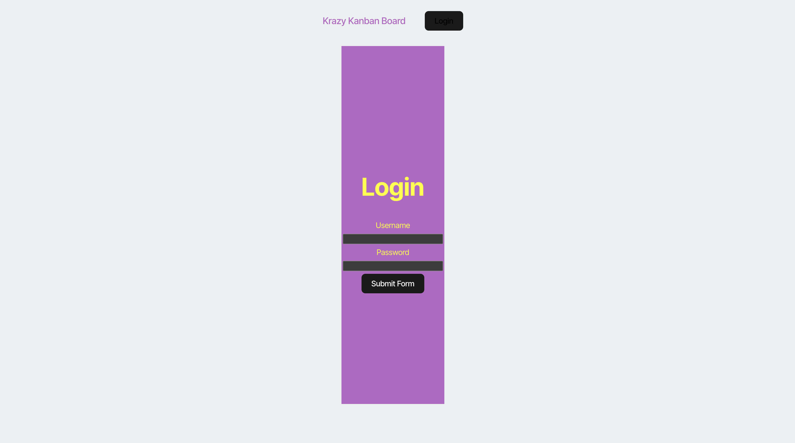
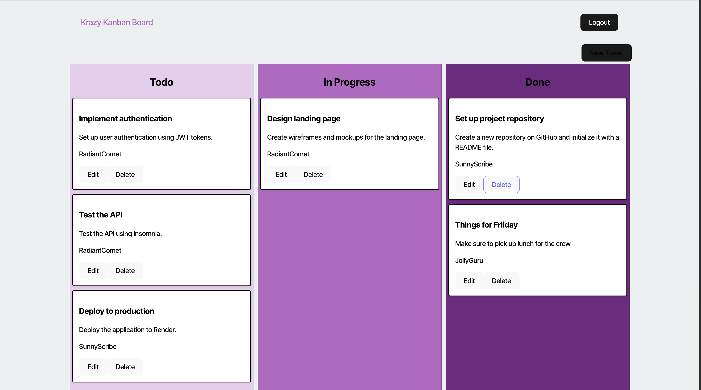
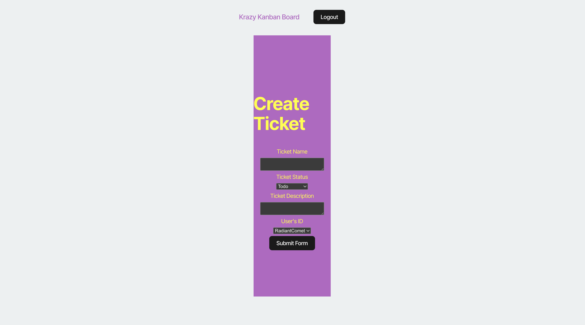

# Kanban Board

  ## License
  
  [MIT License](https://opensource.org/licenses/MIT)

  ## Contents
  ---------
  - [License](#license)
  - [Description](#description)
  - [Installation](#installation)
  - [Contribution](#contribution)
  - [Tests](#tests)
  - [Questions](#questions)

  ## Description
  This application was adapted from starter code given for a working Kanban board style to-do organizer. I added the necessary code for testiing jwt authentication.

  ## Installation
  Clone the repository from github.
  From there you will want to cd to the local repo you just cloned and do an npm install.
  Then npm run build and then npm run server to get it up and runniing locally.

  To login you can use one of three login names: JollyGuru, SunnyScribe, or RadiantComet and password is password for all three.

  ## Contribution
  After cloning the repository be sure to create a new branch for your feature or fix.
  Make your changes and commit them with descriptive messages.
  Submit a Pull Request with clear explanations of your modifications.
  Use meaningful variable names and comments.
  Follow guidelines for Typescript and Javascript code formatting with a PERN stack application.

  ## Tests
  You can see screenshots of the application here and try it out without cloning by clicking on the deployed version on render here: https://kanban-nxug.onrender.com

  
  
  

  ## Questions
  - GitHub: [bjaegerthomas](https://github.com/bjaegerthomas)
  - Email: bjaegerthomas@gmail.com